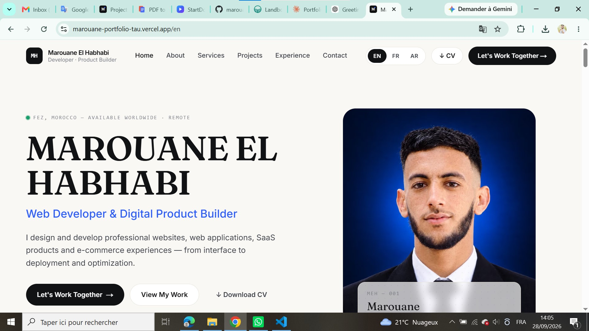

# MAROUANE EL HABHABI — Web Developer & Digital Product Builder

> Web Developer & Designer focused on building professional websites, web applications, SaaS products, e-commerce solutions, and digital experiences.

🌐 **Portfolio:** https://marouane-portfolio-tau.vercel.app/

💼 **LinkedIn:** https://www.linkedin.com/in/marouane-el-habhabi-6b63a2340/

---

## About

I’m a Web Developer & Designer focused on building modern, responsive, and user-friendly digital products.

I work across the full development lifecycle — from UI/UX design and frontend development to backend integration, deployment, SEO, and continuous improvements.

My work includes:

* 🌐 Professional Websites
* 💻 Web Applications
* 🚀 SaaS Products
* 🛒 E-commerce Websites
* 📝 WordPress Websites
* 🎨 UI/UX & Responsive Design
* ⚡ Performance & SEO
* ☁️ Deployment & Web Infrastructure

---

## Featured Projects

### L9A5DMA — Moroccan Services Marketplace

A Moroccan services marketplace designed and developed to connect customers with local professionals and skilled service providers.

🔗 https://l9a5dma.ma/

### PDF2Wordly — PDF to Word Converter

A web-based SaaS platform that allows users to convert PDF documents into editable Word files online.

🔗 https://pdf2wordly.com/

### StartDownloading — Online Video Downloader

A web-based downloader project focused on providing a simple and responsive experience for downloading online media.

🔗 https://startdownloading.com/

### Land-book — Web Design & Development

A modern web design and development project focused on responsive layouts, user experience, and modern web technologies.

🔗 https://land-book.com/

---

## Technologies

### Frontend

* HTML5
* CSS3
* JavaScript
* TypeScript
* React
* Next.js
* Tailwind CSS

### Backend & Data

* Python
* REST APIs
* Supabase
* Database Integration

### Platforms & Tools

* Git
* GitHub
* Vercel
* Railway
* Cloudflare
* WordPress

---

## What I Do

I build digital solutions for businesses, startups, and individuals, including:

* Business websites
* Landing pages
* Web applications
* SaaS products
* E-commerce platforms
* WordPress websites
* Custom web solutions
* Website redesigns
* SEO & performance optimization
* Deployment and maintenance

---

## Contact

Interested in working together?

🌐 Portfolio: https://marouane-portfolio-tau.vercel.app/

💼 LinkedIn: https://www.linkedin.com/in/marouane-el-habhabi-6b63a2340/

📩 Feel free to reach out for freelance projects, collaborations, or digital product development.

---

## License

This repository contains the source code of my personal portfolio website.
